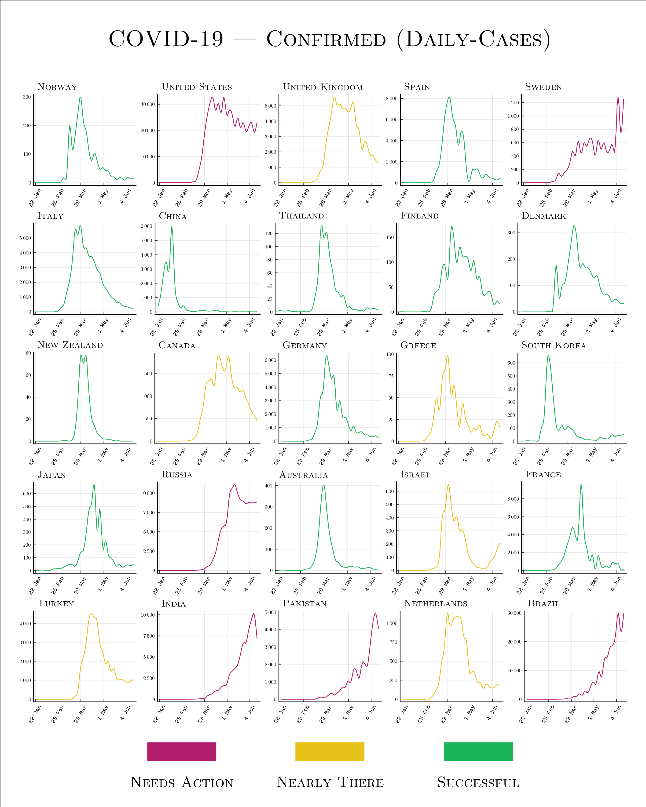
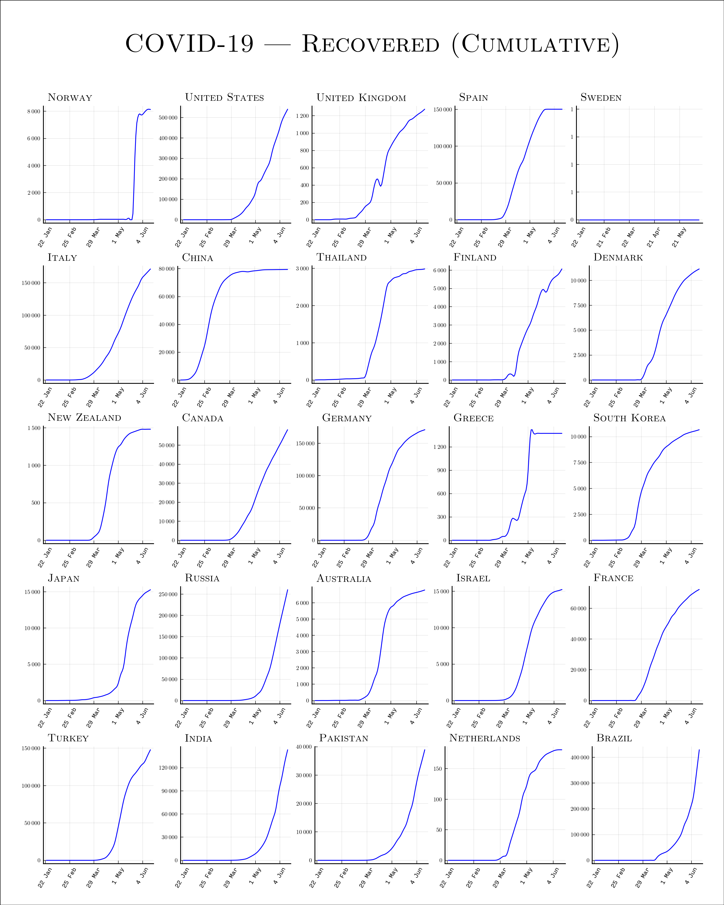

# COVID-19 Graphs

I've caved... Too many annoying graphs.

## Generating Graphs

Clone and `cd` into this repo:

```console
git clone --recursive https://github.com/Demonstrandum/COVID.git
cd COVID
```

Run `main.jl`:

```console
$ julia  # Start REPL
julia> include("main.jl")
```

You can run this multiple times to generate different kinds
of graphs.

Running `./graphs/graph_gen.sh` will generate all graphs.

## Plots






